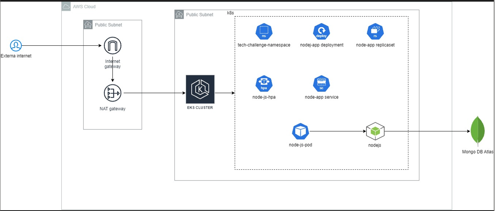

# Tech Challenge Pós Tech Fiap

# FASE III

### Link do vídeo

### Link dos projetos

## ARQUITETURA DO PROJETO

### Arquitetura Autenticação do cliente

Essa arquitetura serverless utiliza serviços da AWS para criar um sistema de autenticação e registro de usuários. O API Gateway serve como a interface HTTP, recebendo requisições nas rotas /auth/login e /auth/register e direcionando-as para as funções AWS Lambda, que são responsáveis por processar o login e o registro. O código dessas funções é armazenado em um bucket S3, que permite a atualização e gerenciamento das funções sem a necessidade de servidores dedicados.

A autenticação dos usuários é feita pelo AWS Cognito, que gerencia o pool de usuários, incluindo dados como CPF, email e nome. O Lambda usa variáveis de ambiente para se integrar ao Cognito, garantindo a autenticação segura dos usuários. As permissões e acessos são controlados por funções do IAM, que asseguram que cada serviço tenha as permissões adequadas para se comunicar de forma segura e eficiente, como o Lambda acessando o S3 e o API Gateway invocando funções Lambda.


### Arquitetura de infraestrutura

Essa arquitetura, implementada em Terraform, provisiona um ambiente completo de Amazon EKS (Elastic Kubernetes Service) em uma VPC (Virtual Private Cloud) personalizada, com o objetivo de rodar uma aplicação Node.js integrada com um banco de dados MongoDB (Mongo Atlas como um database as service). O projeto inclui a criação de subnets públicas e privadas, onde as subnets públicas são conectadas diretamente à internet através de um Internet Gateway para permitir a exposição de serviços públicos, enquanto as subnets privadas utilizam um NAT Gateway para habilitar a comunicação de saída segura sem exposição direta à internet. O cluster EKS é configurado com Fargate para permitir a execução de pods em uma arquitetura serverless, além de um Node Group dedicado que realiza o processamento de cargas de trabalho e oferece maior controle sobre os nós que compõem o cluster.

Dentro do ambiente Kubernetes gerenciado pelo EKS, o projeto entrega uma implementação completa de CI/CD, incluindo o deployment de uma aplicação Node.js. A aplicação é exposta externamente via um serviço LoadBalancer e está protegida por uma Network Policy, garantindo que o tráfego de entrada e saída seja devidamente controlado. Um Horizontal Pod Autoscaler (HPA) foi configurado para gerenciar a escalabilidade automática da aplicação, ajustando o número de réplicas conforme a demanda de CPU, garantindo performance e eficiência. Todo o ambiente foi projetado com foco em alta disponibilidade, segurança e escalabilidade, com suporte completo para operações em um ambiente de produção distribuído.



### Arquitetura do banco de dados

A arquitetura do banco de dados para o projeto foi projetada utilizando MongoDB Atlas, uma plataforma de banco de dados como serviço (DBaaS) que oferece uma solução escalável, segura e de alto desempenho para o armazenamento de dados. A seguir, são apresentados os componentes e características principais dessa arquitetura, alinhados aos códigos e estrutura utilizados no projeto.


#### Cluster MongoDB Atlas

O projeto foi criado utilizando um cluster MongoDB Atlas na mesma região do cluster EKS. A descição de uso do cluster MongoDB Atlas é relativo as vantagens de possuir uma versão gratuita, fácil gestão de acesso via IAM policy com o cluster EKS (No momento não foi criada devido ao usuário da conta de testes não poder criar recursos IAM). A fácil integração a plataforma NodeJs escolhida para o projeto ajudou na descição.

Pela simplicidade dos requisitos do projeto o modelo NoSQL atende a todos os requisitos, foram utilizados os principios de modelos de documentos, utilizando as coleções do mongo e o armazenamento hierarquico dos dados, por exemplo usuario -> transacoes, transacoes => produtos. Tornando fácil a consulta e permitindo todo fluxo do projeto.O esquema fléxivel permite alterações no esquema de dados de forma rápida e fácil, o que é muito útil quando precisamos adaptar a aplicação às mudanças de requisitos. Além disso, como o MongoDB Atlas é uma solução gerenciada, não precisamos nos preocupar com a manutenção da infraestrutura, permitindo que a equipe se concentre em criar e melhorar a aplicação de forma mais eficiente.

#### Estrutura de Dados

O design do esquema foi otimizado para as operações específicas da aplicação, utilizando a flexibilidade do modelo de dados NoSQL do MongoDB. No projeto, a estrutura de dados é representada em documentos BSON, com o uso das seguintes coleções:

##### Produtos:

Armazena informações detalhadas sobre cada produto, incluindo nome, categoria, e preço.

##### Usuários:

Contém os dados dos usuários, como nome, email, e senha (armazenada de forma segura).

##### Transações:

Registra as operações realizadas pelos usuários, incluindo produto_id, usuario_id, e data.

#### Monitoramento e Performance

Performance Monitoring: O MongoDB Atlas fornece ferramentas de monitoramento em tempo real que permitem visualizar métricas de desempenho, como latência de consultas, utilização de CPU e IOPS. Essas métricas são essenciais para identificar gargalos e otimizar a performance do banco de dados.
Alerts: Alertas foram configurados para notificar a equipe de desenvolvimento sobre quaisquer anomalias de performance ou disponibilidade, permitindo uma resposta rápida a potenciais problemas.

#### Backup e Recuperação

Backups Automáticos: O MongoDB Atlas realiza backups automáticos de forma regular, garantindo que os dados possam ser recuperados em caso de falhas ou perda de dados. A frequência e a retenção dos backups são configuráveis, permitindo atender às necessidades específicas do projeto

<!-- [alt text](image.png) -->

<!-- # Fase II

## Link do Vídeo

https://youtu.be/rC-bWRvodd8

# Arquitetura do Projeto

Abaixo temos o entregável 3 do tech challenge, sendo o desenho da arquitetura de negócio e o desenho da arquitetura de infraestrutura

## Arquitetura de negócio

## Arquitetura de infraestrutura

!

[Link do miro](https://miro.com/app/board/uXjVKMS64KM=/?moveToWidget=3458764594688140656&cot=14)

# Como Executar o Projeto

## Pré-requisitos

1. Antes de começar, certifique-se de que você possui os seguintes itens instalados no seu PC:

- [Docker](https://docs.docker.com/get-docker/)
- [kubectl](https://kubernetes.io/docs/tasks/tools/install-kubectl/)
- [Minikube](https://minikube.sigs.k8s.io/docs/start/)

### 1. Instalar Docker

Siga as instruções no [site oficial do Docker](https://docs.docker.com/get-docker/) para instalar o Docker em seu sistema operacional.

### 2. Instalar kubectl

Baixe o kubectl a partir do [site oficial do Kubernetes](https://kubernetes.io/docs/tasks/tools/install-kubectl/) e siga as instruções de instalação para o seu sistema operacional.

### 3. Instalar Minikube

Siga as instruções no [site oficial do Minikube](https://minikube.sigs.k8s.io/docs/start/) para instalar o Minikube em seu sistema operacional.

### 4. Iniciar Minikube

Após instalar o Minikube, inicie um cluster Kubernetes com o comando:

```sh
minikube start
```

### 5. Configurar kubectl para usar o Minikube

Verifique se o kubectl está configurado para usar o Minikube:

```sh
kubectl config use-context minikube
```

### 6. Criar Namespace

Crie um namespace chamado tech-challenge-namespace:

```sh
kubectl create namespace  tech-challenge-namespace
```

### 7. Clone este repositório em sua máquina local.

via ssh

```
git clone git@github.com:hiagorubio/tech-challenge-hiago.git
```

ou via http

```
git clone git@github.com:hiagorubio/tech-challenge-hiago.git
```

### 8. Navegue até o diretório raiz do projeto.

```
cd {sua-pasta-onde-foi-clonado}/tech-challenge-hiago
```

### 9. Execute o comando abaixo para configurar o kubernets.

Esse comando cria toda a infraestrutura necessária, o desenho da arquitetura está no item [Arquitetura de infraestrutura](##-Arquitetura-de-infraestrutura)

```
kubectl apply -f k8s
```

### 10. Verifique se todos os pods estão em execução

```
kubectl get pods -n tech-challenge-namespace
```

### 11. Faça o port-foward para expor a serviço do backend

Abra um terminal e rode o seguinte comando:

```
kubectl port-forward svc/nodejs-service 3000:3000 -n
```

### 12. As APIs estarão disponíveis nos seguintes URLs:

- Cadastro de Usuário: http://localhost:3000/cadastro
- Identificação do Cliente: http://localhost:3000/identificacao
- Listagem de Produtos: http://localhost:3000/admin/products/:category
- Atualização de Produto: PATCH http://localhost:3000/admin/products
- Exclusão de Produto: DELETE http://localhost:3000/admin/products
- Checkout de Pedido: http://localhost:3000/pedido/checkout
- Listagem de Pedidos: http://localhost:3000/pedido

### [Opcional] 13. Caso queira checar a criação dos dados no mongo

Abra outro terminal e execute o seguinte comando:

```sh
kubectl port-forward svc/mongo-express 8081:8081 -n tech-challenge-hiago
```

Isso fará com que o [Mongo-Express](https://github.com/mongo-express/mongo-express) esteja acessível localmente em http://localhost:8081. -->

<!-- # Itens da fase I

# Como Rodar o Projeto com Docker Compose

## Requisitos

- Docker: Para criar e gerenciar contêineres.
- Docker Compose: Para definir e executar aplicativos Docker com vários contêineres.

## Execução

1.  Clone o repositório do projeto em sua máquina local:

ssh:

```bash
git clone git@github.com:hiagorubio/tech-challenge-hiago.git
```

https:

```bash
git clone https://github.com/hiagorubio/tech-challenge-hiago.git
```

1. Acessa a pasta do arquivo:

```bash
cd tech-challenge-hiago
```

3. Inicie o docker compose

```bash
docker-compose up -d
```

## Execução local sem uso do docker

1. Siga os passos 1 e 2 do guia anterior
2. Certifique de ter o [node](https://nodejs.org/) instalado no seu computador;
3. Instale as dependencias:

```bash
npm install
```

4. Inicie uma instancia do mongo db com o docker:

```bash
docker run -d --name mongodb -p 27017:27017 mongo:latest
```

5. Inicie o projeto

```bash
npm run dev
```

1.Acesse http://localhost:3000/api-docs

# Documentação das APIs

Este é um guia de referência para as APIs disponíveis neste projeto.

## Tecnologias Utilizadas

- Node.js
- TypeScript
- MongoDB
- Docker
- Docker Compose

## Endpoints Disponíveis

### 1. Cadastro de Usuário

#### `POST /cadastro`

Este endpoint é usado para cadastrar um novo usuário.

**Request Body:**

```json
{
  "name": "Nome do usuário",
  "email": "email@example.com",
  "cpf": "12345678900"
}
```

#### Respostas:

- 200 OK: Cadastro realizado com sucesso.
- 400 Bad Request: Se os dados fornecidos forem inválidos.
- 500 Internal Server Error: Se ocorrer um erro durante o cadastro.

### 2. Identificação do Cliente

#### `POST /identificacao`

Este endpoint é usado para identificar um cliente com base no CPF.

**Request Body:**

```json
{
  "cpf": "12345678900"
}
```

#### Respostas:

- 200 OK: Cliente identificado com sucesso. Retorna os detalhes do cliente.
- 400 Bad Request: Se o CPF fornecido for inválido.
- 500 Internal Server Error: Se ocorrer um erro durante a identificação do cliente.

### 3. Listagem de Produtos por Categoria (Admin)

#### `GET /admin/products/:category`

Este endpoint é usado para listar produtos com base em uma categoria.

**Parâmetros:**

- `:category` (string): Categoria dos produtos (por exemplo, "Lanches", "Bebidas").

#### Respostas:

- 200 OK: Retorna uma lista de produtos da categoria especificada.
- 400 Bad Request: Se a categoria fornecida for inválida.
- 500 Internal Server Error: Se ocorrer um erro durante a listagem dos produtos.

### 4. Atualização de Produto (Admin)

#### `PATCH /admin/products`

Este endpoint é usado para atualizar um produto.

**Request Body:**

```json
{
  "id": "id_do_produto",
  "name": "Novo nome do produto",
  "category": "Nova categoria do produto",
  "price": 10.99
}
```

#### Respostas:

- 200 OK: Produto atualizado com sucesso. Retorna os detalhes do produto atualizado.
- 400 Bad Request: Se os dados fornecidos forem inválidos.
- 500 Internal Server Error: Se ocorrer um erro durante a atualização do produto.

### 5. Exclusão de Produto (Admin)

#### `DELETE /admin/products`

Este endpoint é usado para excluir um produto.

**Request Body:**

```json
{
  "id": "id_do_produto"
}
```

#### Respostas:

- 200 OK: Produto excluído com sucesso.
- 400 Bad Request: Se o ID do produto fornecido for inválido.
- 500 Internal Server Error: Se ocorrer um erro durante a exclusão do produto.

### 6. Checkout de Pedido

#### `POST /pedido/checkout`

Este endpoint é usado para realizar o checkout de um pedido.

**Request Body:**

```json
{
  "client": {
    "id": "id_do_cliente",
    "name": "Nome do cliente"
  },
  "products": [
    {
      "id": "id_do_produto",
      "name": "Nome do produto",
      "category": "Categoria do produto",
      "price": 10.99
    }
  ],
  "totalValue": 10.99,
  "totalItens": 1
}
```

#### Respostas:

- 201 Created: Pedido realizado com sucesso. Retorna os detalhes do pedido.
- 400 Bad Request: Se os dados fornecidos forem inválidos.
- 500 Internal Server Error: Se ocorrer um erro durante o checkout do pedido.

### 7. Listagem de Pedidos

#### `GET /pedido`

Este endpoint é usado para listar pedidos com base em um status.

**Parâmetros de Cabeçalho:**

- `pedido_status` (string): Status do pedido (por exemplo, "RECEBIDO", "EM_PREPARO").

#### Respostas:

- 200 OK: Retorna uma lista de pedidos com base no status especificado.
- 500 Internal Server Error: Se ocorrer um erro durante a listagem dos pedidos. -->
